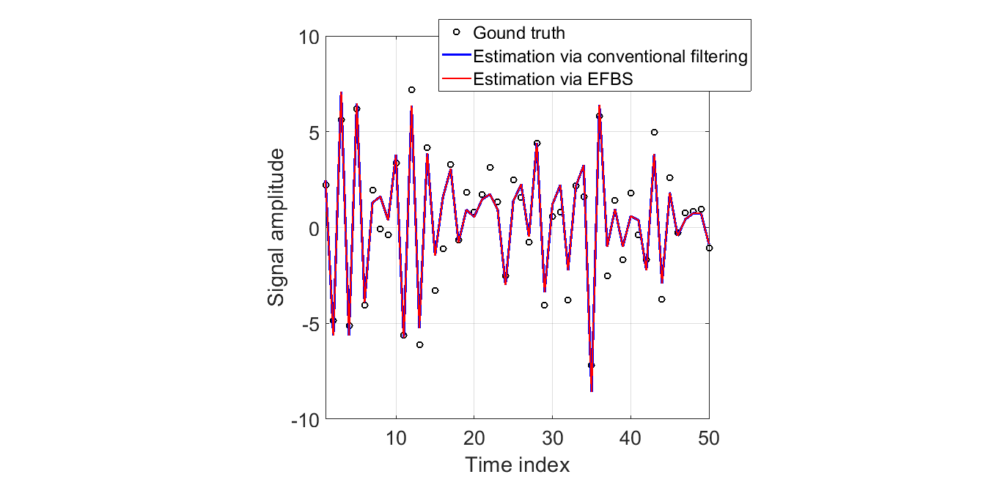
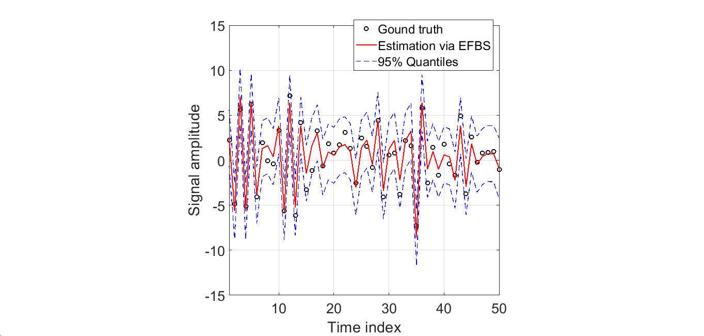

# EfficientFFBS
Efficient Forward Filtering and Backward Smoothing

Description: This repository contains implementations of the conventional and efficient forawrd filtering and backward smoothing.

Copyright (c) 2020 Behrad Soleimani All Rights Reserved

Contact: behrad@umd.edu

Citation: If you find these piece of codes helpful in your reserach, please cite the following paper

-Soleimani, B., P. Das, P., J. Kulasingham, J. Z. Simon and B. Babadi (2020) Granger Causal Inference from Indirect Low-Dimensional Measurements with Application to MEG Functional Connectivity Analysis, 2020 54th Annual Conference on Information Sciences and Systems.

Date: March 5, 2020

Requirements: implemented in Matlab R2019a version, but should run on most versions.

Contents: 
> main.m:       **Master script**. 

> EFBS.m:       **Efficient forward filtering and backward smoothing function**.

> Filtering.m:  **Conventional forward filtering and backward smoothing function**.

> EfficientFFBS.pdf: **Derivation and details of the algorithm**.

Instructions: Simple and easy. Download all the codes in a directory and run main.m, that will generate one example described below. To use the functions individually, please look at the function descriptions. The derivations and details are also explained in .pdf file.

Example:

In this example, we assume that there are Ny=3 observations, Nx=5 sources, and T=50 time samples. The underlying source dynamic is considered as an vector auto-regressive process with 1 lag, i.e. VAR(1). The noise covariance matrix is also assumed to be diagonal.

In Fig.1, the estimated verions of the source #1, i.e. non-causal belifes p(xt | y1:T), and ground truth are compared. As it can be seen, the performance of the conventional filtering scheme (Kalman filtering) is almost the same as the EfficientFFBS. 

|  | 
|:--:| 
| Fig 1. Comparison of the conventional filtering and EfficientFFBS |

In Fig.2, the 95% quantile of the estimation (via EfficientFFBS) is depicted to demonstrate the it can be an acceptable estimation of the true value with high confidence interval.

|  | 
|:--:| 
| Fig 2. The estimation of EfficientFFBS with 95% quantile |
